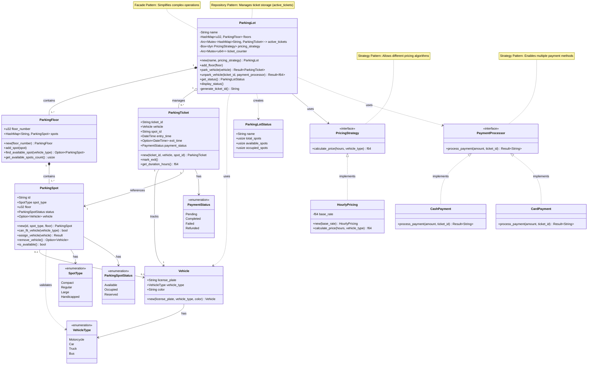

# Parking Lot Demo Project

(UML generated by Claude - by providing main classes in prompt)

## Description

This is a parking lot project that simulates a parking lot with multiple floors and spots. It also simulates a parking ticket system that allows users to park their vehicles and pay for their parking. It also simulates a parking display board that shows the number of floors, empty spots, and parked vehicles.

## Use case
1. Users should be able to book an unreserved spot
2. Users should be able to pay for their parking
3. Users should be able to leave their vehicle
4. Users should be able to view the parking display board
5. Users should be Add, remove or edit parking spot
6. Users should be able to see unreserved spots

## Actors
1. User
2. Admin
3. System

## Main classes
1. ParkingLot
2. ParkingFloor
3. ParkingSpot
4. ParkingTicket
5. ParkingCharge
6. ParkingDisplayBoard
7. Vehicle
8. User
9. Admin
10. System
